# OneTap eLeague 

## 👥 Miembros del Equipo
| Nombre y Apellidos | Correo URJC | Usuario GitHub |
|:--- |:--- |:--- |
| Angel Molinero Caja | a.molinero.2023@alumnos.urjc.es | anxelito |
| Jorge Castellano Bajo | j.castellano.2023@alumnos.urjc.es | jorgeC2110 |
| Pedro González Martín | p.gonzalezm.2023@alumnos.urjc.es | glezpedro |
---

## 🎭 **Preparación: Definición del Proyecto**

### **Descripción del Tema**
Página web destinada a organizar torneos eSports universitarios de distintos videojuegos. La página web tendrá diversas funcionalidades buscando la mejor experiencia y claridad posible para cada usuario. La aplicación incluirá la clasificación general de cada torneo, resultado de cada enfrentamiento de dichos torneos, estadísticas generales de equipos y muchasmás funcionalidades.

### **Entidades**
Indicar las entidades principales que gestionará la aplicación y las relaciones entre ellas:

1. **Usuario**: Representa a los jugadores y administradores de la plataforma.
2. **Equipo**: Representa la grupación de usuarios que compiten conjuntamente en un mismo grupo.
3. **Torneo**: Representa la competición o liga en la que se inscriben los distintos equipos.
4. **Partido**: Representa el enfrentamiento específico entre dos equipos dentro de un torneo.


**Relaciones entre entidades:**
- Usuario - Equipo (1:N): Un usuario puede ser propietario de varios equipos
- Usuario - Equipo (N:N): Un usuario puede ser miembro de múltiples equipos, y un equipo puede tener múltiples miembros.
- Usuario - Torneo (1:N): Un usuario administrador puede crear varios torneos.
- Equipo - Torneo (N:M): Un equipo puede permanecer a múltiples torneos, y un torneo puede tener múltiples equipos.
- Torneo - Partida (1:N): Un torneo contiene varias partidas, y cada partida pertenece a un torneo.
- Equipo - Partida (N:M): Un equipo puede participar en múltiples partidas, y cada partida enfrenta a exactamente dos equipos.
- Usuario - Partida (N:M): Un usuario participa en múltiples partidas mediante su equipo. 

### **Permisos de los Usuarios**
Describir los permisos de cada tipo de usuario e indicar de qué entidades es dueño:

* **Usuario no registrado**: 
  - Permisos: Visualización de clasificaciones general, resultados de cada partido, detalles avanzados de los mismos y vista + detalles de equipos que participan.
  - No es dueño de ninguna entidad
 
* **Usuario integrante de equipo**:
  - Permisos: El usuario registrado podrá ver las estadísticas avanzadas de su propio equipo, con los integrantes (con sus respectivos IDs) y los torneos a los que pertenece. Podrá elegir sus torneos favoritos y verlos en una pantalla extra. A parte podrá editar su perfil, incluyendo una foto.
  - Es dueño de: Usuario y Equipo

* **Administrador**: 
  - Permisos: Configuración de nuevos de torneos/ligas, añadir resultados de cada partido, enviar mensajes a los capitanes de cada equipo, ver todos los equipos/usuarios, modificar permisos de usuarios, añadir o eliminar integrantes, ver listado de personas por equipo y elegir capitán.
  - Es dueño de: Puede gestionar todos los usuarios, equipos, torneos y partidos.

### **Imágenes**
Indicar qué entidades tendrán asociadas una o varias imágenes:

- **[Torneos]**: Los torneos tendrán asociados una imágen del juego que es jugado.
- **[Equipo]**: Cada equipo tendrá una imágen o logo representativo de su equipo, más un banner en la pantalla de detalles del equipo.
- **[Usuario]**: Cada usuario podrá editar su perfil, añadiendo una imágen.
- **[Partido]**: Cada partido tendrá asociados los logos de los equipos participantes.

### **Gráficos**
Indicar qué información se mostrará usando gráficos y de qué tipo serán:

- **Gráfico 1**: Cada usuario podrá ver sus estadísticas personales en su apartad de "Mi perfil"

### **Tecnología Complementaria**
Indicar qué tecnología complementaria se empleará:

- [Ej: Envío de correos electrónicos automáticos mediante JavaMailSender]
- [Ej: Generación de PDFs de facturas usando iText o similar]

### **Algoritmo o Consulta Avanzada**
Indicar cuál será el algoritmo o consulta avanzada que se implementará:

- **Algoritmo/Consulta**: [Ej: Sistema de recomendaciones basado en el historial de compras del usuario]
- **Descripción**: [Ej: Analiza los productos comprados previamente y sugiere productos similares o complementarios utilizando filtrado colaborativo]
- **Alternativa**: [Ej: Consulta compleja que agrupe ventas por categoría, mes y región, con cálculo de tendencias]

---

## 🛠 **Práctica 1: Maquetación de páginas web con HTML y CSS**

### **Diagrama de Navegación**
Diagrama que muestra cómo se navega entre las diferentes páginas de la aplicación:


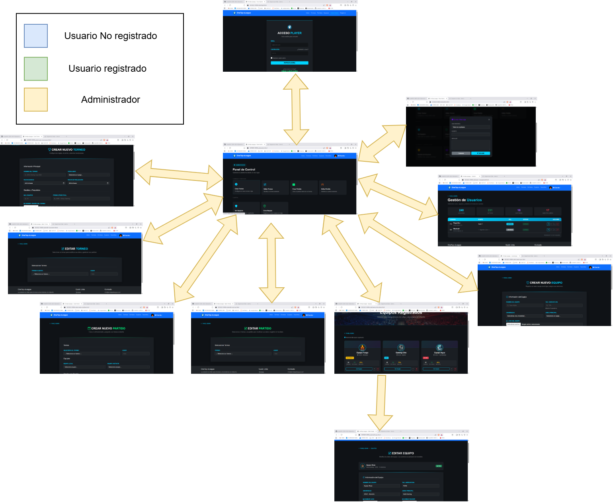

> [Todas las ventanas comparten Navbar y footer. Desde todas las páginas se pueden acceder al resto a través del NavBar, dependiendo de los permisos que tengan]

### **Capturas de Pantalla y Descripción de Páginas**

#### **1. Página Principal / Home**


> [Es la página de inicio o landing page. Muestra la bienvenida y el contenido principal público de la plataforma.]

#### **2. Página Login**
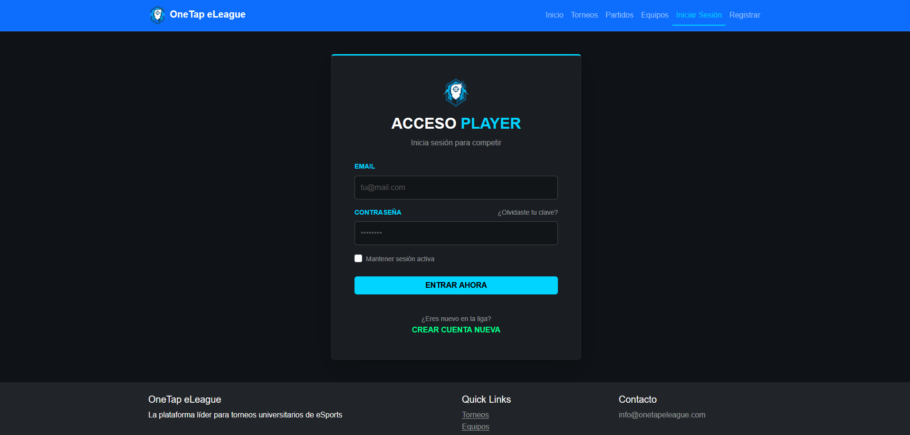

> [Pantalla de inicio de sesión. Permite a los usuarios y administradores introducir sus credenciales para acceder a sus cuentas.]

#### **3. Página Registrarse**
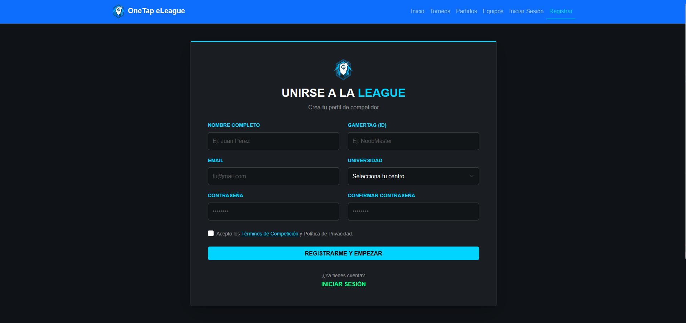

> [Formulario de registro para que nuevos usuarios puedan crearse una cuenta en la plataforma.]

#### **4. Página Perfil**
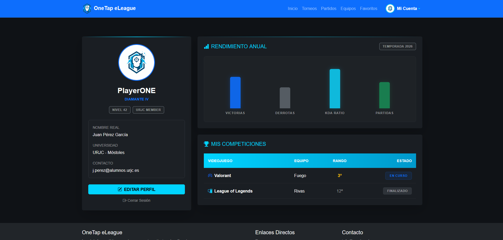

> [La página del perfil del usuario autenticado. Aquí el usuario puede consultar su información personal, equipos, y editar sus datos (como la foto de perfil).]

#### **5. Página Favoritos**
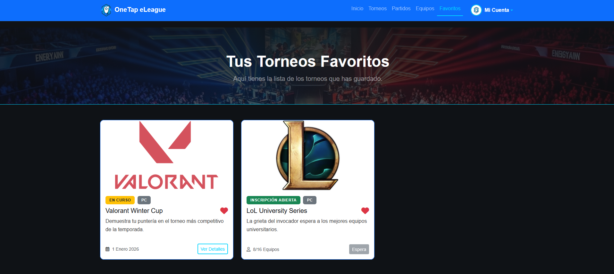

> [La página del perfil del usuario autenticado. Aquí el usuario puede consultar su información personal, equipos, y editar sus datos (como la foto de perfil).]

#### **6. Página Torneos**
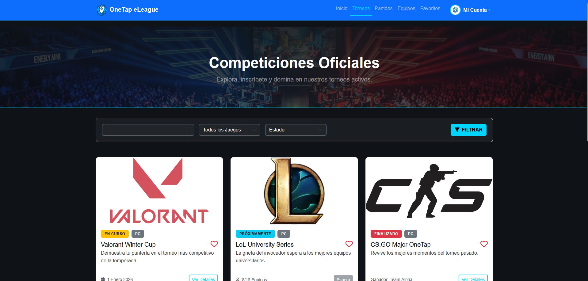

> [Listado o catálogo público que muestra todos los torneos disponibles, permitiendo buscar o filtrar.]

#### **7. Página Detalles Torneos**
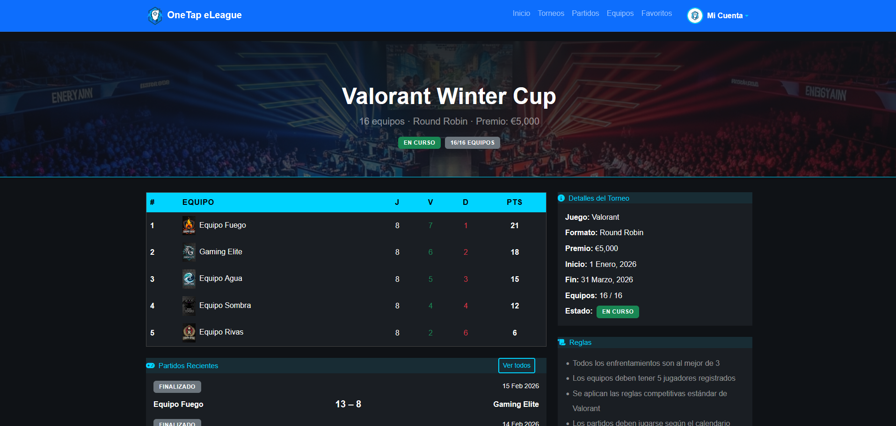

> [Vista detallada de un torneo en específico (muestra reglas, equipos inscritos, fechas y brackets/enfrentamientos)]

#### **8. Página Crear Torneo**
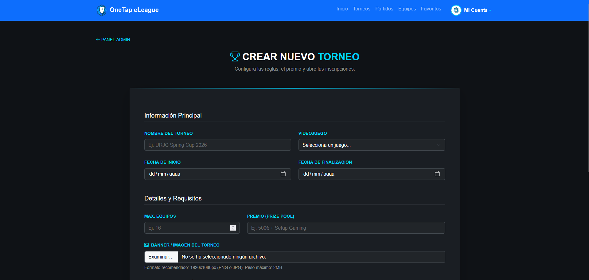

> [Formulario para organizar y registrar un nuevo torneo en la plataforma.]

#### **9. Página Editar Torneo**
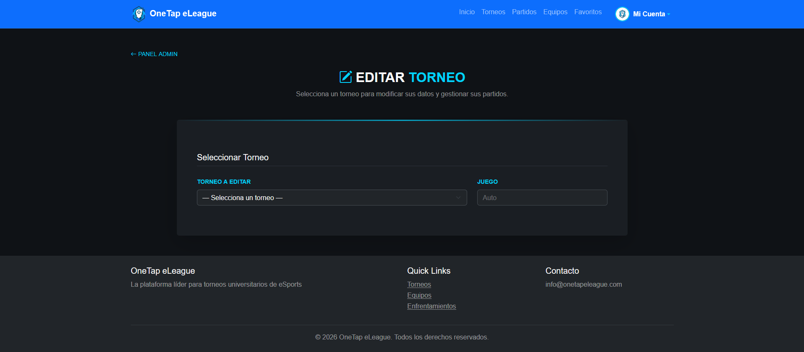

> [Pantalla destinada a modificar la información, configuración o estado de un torneo ya existente.]

#### **10. Página Equipos**
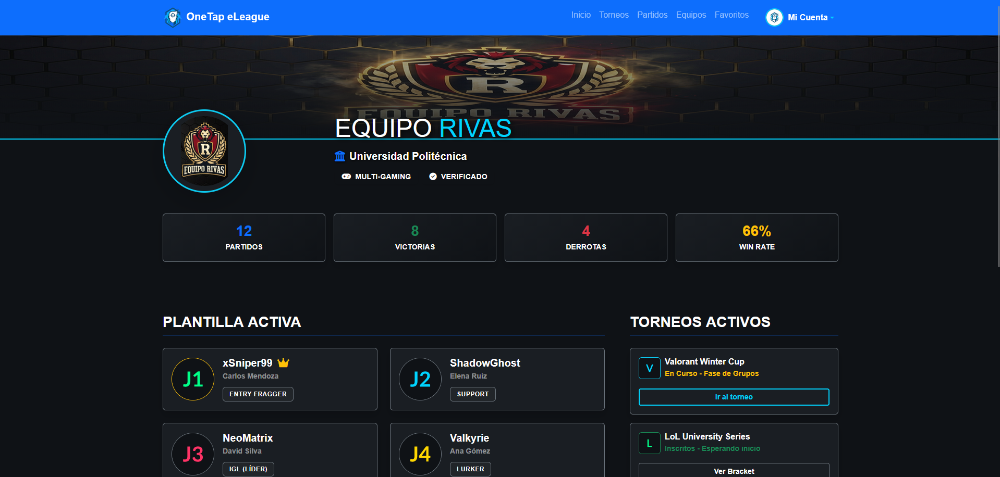

> [Páginas de listado público de los equipos registrados. Permiten al usuario explorar los distintos equipos que compiten.]

#### **11. Página Crear Equipos**
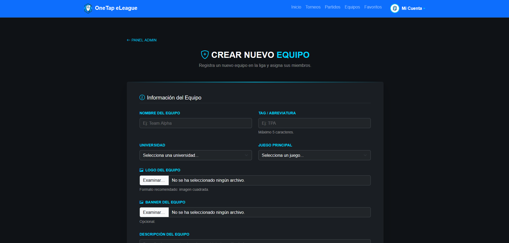

> [Formulario mediante el cual un usuario puede registrar un nuevo equipo, asignándole un nombre y detalles.]

#### **12. Página Editar Equipos**
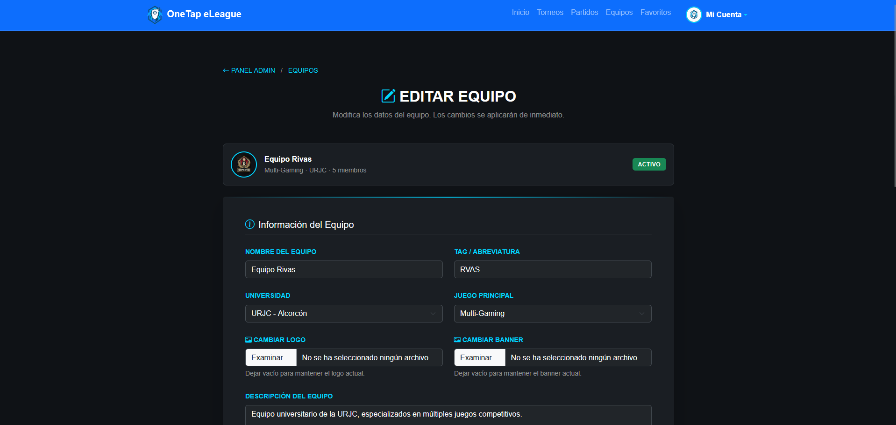

> [Pantalla para gestionar y modificar un equipo ya creado (cambiar el logo, editar información o miembros).]

#### **13. Página Partidos**
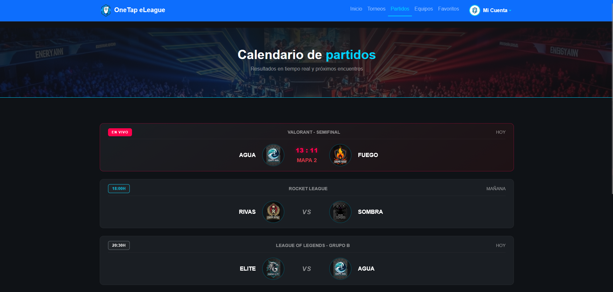

> [Pantalla para gestionar y modificar un equipo ya creado (cambiar el logo, editar información o miembros).]

#### **14. Página Editar Partidos**
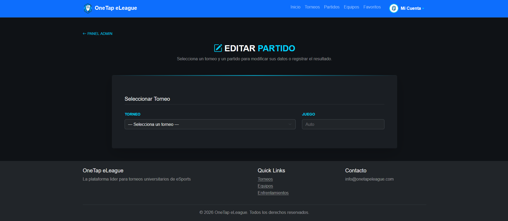

> [Listado general de los enfrentamientos o partidos (ya sean futuros, en vivo o resultados pasados).]

#### **15. Página Detalles Partidos**
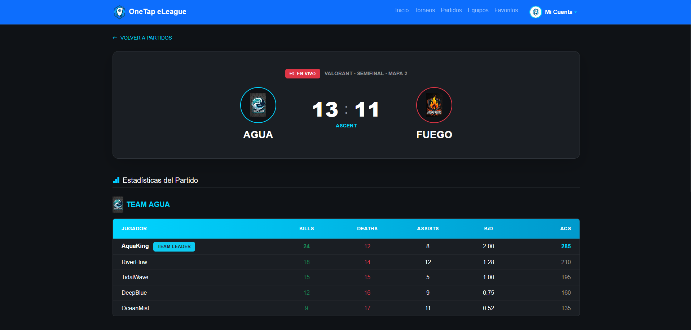

> [Vista en profundidad de un partido concreto, mostrando quiénes se enfrentan, el marcador y estadísticas del encuentro.]

#### **16. Página Crear Equipos**


> [Interfaz para programar y generar nuevos partidos dentro del cuadro de los torneos.]

#### **17. Página Editar Equipos**


> [Formulario para actualizar la información de un partido existente, como reportar el resultado final o cambiar la fecha.]

#### **18. Página Admin**
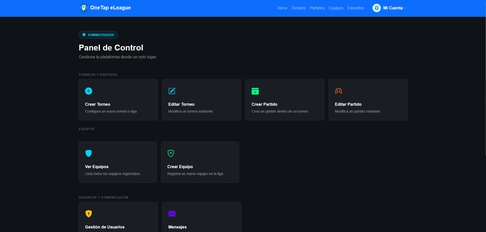

> [El dashboard o panel de control principal exclusivo para administradores, donde pueden ver métricas y accesos rápidos a la gestión.]

#### **19. Página Administración Miembros**
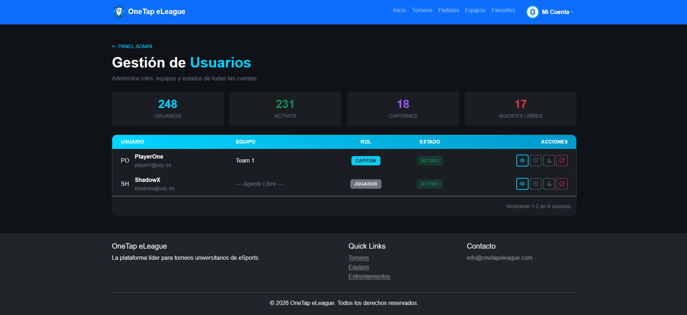

> [Interfaz donde los administradores pueden gestionar a todos los usuarios de la plataforma (ver roles, banear, editar cuentas o ascender a otros administradores).]

#### **20. Página Administración Equipos**
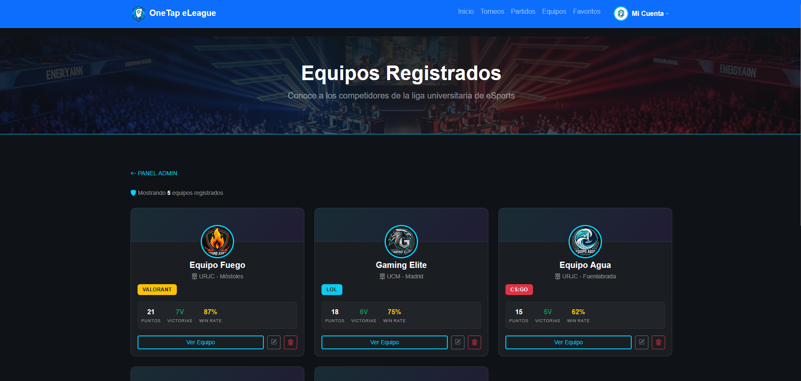

> [Listado de equipos con privilegios de administrador, incluyendo botones y acciones para forzar la edición o eliminación de cualquier equipo de la plataforma.]

### **Participación de Miembros en la Práctica 1**

#### **Alumno 1 - [Pedro González Martín]**

[Realización de parte de las páginas de admin (como el panel, la vista de equipos, la creación y edición de partidos, y la gestión de usuarios), implementando la lógica de navegación y el flujo de trabajo entre ellas. Además, me he encargado de la creación de sus correspondientes archivos CSS, así como de una limpieza y reorganización global, eliminando código muerto y duplicados de todos los estilos del proyecto para unificar el diseño.]

| Nº    | Commits      | Files      |
|:------------: |:------------:| :------------:|
|1| [Limpieza y reorganización global de todos los archivos CSS eliminando código duplicado y reordenandolo](https://github.com/CodeURJC-SSDD-2025-26/practica-ssdd-2025-26-grupo-7/commit/5f9cf4506dd7fa51b29f2320c6df2e422e7a7dce)  | [style.css](https://github.com/CodeURJC-SSDD-2025-26/practica-ssdd-2025-26-grupo-7/blob/5f9cf4506dd7fa51b29f2320c6df2e422e7a7dce/code/css/style.css)   |
|2| [Creación de la lógica de equipos desde la vista del admin. Primera versión de páginas como crear equipo, editar equipo y ver lista de equipos. ](https://github.com/CodeURJC-SSDD-2025-26/practica-ssdd-2025-26-grupo-7/commit/ec6138b90e5bed7bae828a629598cdc00365f14b)  | [create-team.html](https://github.com/CodeURJC-SSDD-2025-26/practica-ssdd-2025-26-grupo-7/blob/ec6138b90e5bed7bae828a629598cdc00365f14b/code/create-team.html)  
|3| [Reorganización de la lógica de crear partidos y torneos por parte del admin.](https://github.com/CodeURJC-SSDD-2025-26/practica-ssdd-2025-26-grupo-7/commit/758586451eae823a07dd036d7f8e63ac198db8c2)  | [admin.html](https://github.com/CodeURJC-SSDD-2025-26/practica-ssdd-2025-26-grupo-7/blob/758586451eae823a07dd036d7f8e63ac198db8c2/code/admin.html)   |
|4| [Separación de las listas de equipos. Se crean dos vistas, una para usuario y otra con posibilidad de editar para el admin.](https://github.com/CodeURJC-SSDD-2025-26/practica-ssdd-2025-26-grupo-7/commit/be1ec4c3bfa6acc33d371cee2b96585704549149#diff-507df1fe7dd4ccf0b4219aa1e29df5218f5881554b163a47955b6fdda590f173)  | [team-list-admin.html](https://github.com/CodeURJC-SSDD-2025-26/practica-ssdd-2025-26-grupo-7/blob/be1ec4c3bfa6acc33d371cee2b96585704549149/code/teams-list-admin.html)   |
|5| [Creación de la parte del admin de edición de partidos.](https://github.com/CodeURJC-SSDD-2025-26/practica-ssdd-2025-26-grupo-7/commit/1e9c38b540c3a140f662f830684a3e0bcf2a3623#diff-9a16d31ec12793f59b375fc3252173572f21b501f28ea33ec8e65d968ca2f766)  | [edit-matches.html](https://github.com/CodeURJC-SSDD-2025-26/practica-ssdd-2025-26-grupo-7/blob/1e9c38b540c3a140f662f830684a3e0bcf2a3623/code/edit-matches.html)   |

---

#### **Alumno 2 - [Angel Molinero Caja]**

[El alumno ha liderado el diseño y desarrollo del frontend y la interfaz de usuario, encargándose de la creación de las páginas clave (perfil, registro y torneos) y la implementación de una navegación dinámica basada en el estado del usuario. Su labor incluyó la maquetación mediante HTML, CSS y JS.]

| Nº    | Commits      | Files      |
|:------------: |:------------:| :------------:|
|1| [Update: nav bar, profile.html, Add: profile.css](https://github.com/CodeURJC-SSDD-2025-26/practica-ssdd-2025-26-grupo-7/commit/a1f4d5f) | [profile.css](https://github.com/CodeURJC-SSDD-2025-26/practica-ssdd-2025-26-grupo-7/blob/main/code/css/profile.css) |
|2| [Update: matches.html image route](https://github.com/CodeURJC-SSDD-2025-26/practica-ssdd-2025-26-grupo-7/commit/437386f) | [matches.html](https://github.com/CodeURJC-SSDD-2025-26/practica-ssdd-2025-26-grupo-7/blob/main/code/matches.html) |
|3| [Updated: edit and create tournament.html and .css](https://github.com/CodeURJC-SSDD-2025-26/practica-ssdd-2025-26-grupo-7/commit/9e954f9) | [create-tournament.html](https://github.com/CodeURJC-SSDD-2025-26/practica-ssdd-2025-26-grupo-7/blob/main/code/create-tournament.html) |
|4| [Add: tournaments and favourites pages](https://github.com/CodeURJC-SSDD-2025-26/practica-ssdd-2025-26-grupo-7/commit/c9da3c5) | [favourite.html](https://github.com/CodeURJC-SSDD-2025-26/practica-ssdd-2025-26-grupo-7/blob/main/code/favourite.html) |
|5| [Add: register.html and updated comments](https://github.com/CodeURJC-SSDD-2025-26/practica-ssdd-2025-26-grupo-7/commit/4672a50) | [register.html](https://github.com/CodeURJC-SSDD-2025-26/practica-ssdd-2025-26-grupo-7/blob/main/code/register.html) |


---

#### **Alumno 3 - [Jorge Castellano Bajo]**

[Realización de detalles del proyecto global mediante el styles.css y edicion de varios css individuales. Realización de páginas como detalles de equipo, página de selección de torneos o detalles de partidos individuales. También encargado de organizar el proyecto, organizandonlos comentarios de los archivos, y trabajando en el diseño y flujo de pantallas]

| Nº    | Commits      | Files      |
|:------------: |:------------:| :------------:|
|1| [Update: Teams.html](https://github.com/CodeURJC-SSDD-2025-26/practica-ssdd-2025-26-grupo-7/tree/350cd16effe188adba2f96c16caa1f9a69200f29)  | [Teams.html](code/teams.html)   |
|2| [Update: Admin.html](https://github.com/CodeURJC-SSDD-2025-26/practica-ssdd-2025-26-grupo-7/tree/5ce4649df9b3328c864221c858da326ed5932bb2)  | [Admin.html](code/admin.html)   |
|3| [Update: tournaments.html](https://github.com/CodeURJC-SSDD-2025-26/practica-ssdd-2025-26-grupo-7/tree/8d98369f082e6034aaf12713ee525d635bd136ae)  | [tournaments.html](code/tournaments.html)   |
|4| [Update:css](https://github.com/CodeURJC-SSDD-2025-26/practica-ssdd-2025-26-grupo-7/tree/45d56492f18d12edfbde6d478de726bef0e8d202)  | [styles.css](code/CSS/styles.css)   |
|5| [Added: Match detail](https://github.com/CodeURJC-SSDD-2025-26/practica-ssdd-2025-26-grupo-7/tree/b6b33fcaeca02e7769e52b49fe77b287ea227e0d)  | [match-detail](code/match-detail)   |

---

## 🛠 **Práctica 2: Web con HTML generado en servidor**

### **Navegación y Capturas de Pantalla**

#### **Diagrama de Navegación**


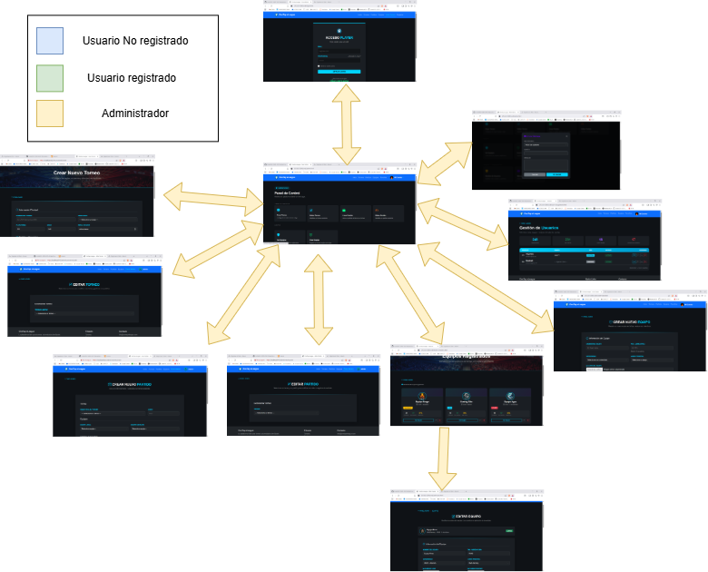

#### **Capturas de Pantalla Actualizadas**

Solo si han cambiado.

### **Instrucciones de Ejecución**

#### **Requisitos Previos**
- **Java**: versión 21 o superior
- **Maven**: versión 3.8 o superior
- **MySQL**: versión 8.0 o superior
- **Git**: para clonar el repositorio

#### **Pasos para ejecutar la aplicación**

1. **Clonar el repositorio**
   ```bash
   git clone https://github.com/CodeURJC-SSDD-2025-26/practica-ssdd-2025-26-grupo-7.git
   ```

2. **Iniciar la base de datos en docker**
   ```bash
   docker run --name mysql-practica -e MYSQL_ROOT_PASSWORD=12345 -e MYSQL_DATABASE=ssdd_prac2 -p 3306:3306 -d mysql:latest
   ```

3. **Iniciar el backend**
   ```bash
   cd .\code\backend
   mvn spring-boot:run
   ```

4. **Abrir la web en el navegador**
   ```bash
   http://localhost:8443
   ```

#### **Credenciales de prueba**
- **Usuario Admin**: usuario: `admin`, contraseña: `pass123`
- **Usuario Registrado**: usuario: `user`, contraseña:`pass123`

### **Diagrama de Entidades de Base de Datos**

Diagrama mostrando las entidades, sus campos y relaciones:


> El diagrama muestra las relaciones entre las entidades principales: Usuarios, Equipos, Torneos y Partidos. También incluye los Mensajes entre usuarios y las Estadísticas detalladas de los jugadores en cada encuentro.

### **Diagrama de Clases y Templates**

Diagrama de clases de la aplicación con diferenciación por colores o secciones:


> El diagrama muestra la separación de responsabilidades de la aplicación en 5 capas principales. Las flechas continuas representan el flujo de inyección de dependencias y llamadas de servicio.

### **Participación de Miembros en la Práctica 2**

#### **Alumno 1 - [Pedro González Martín]**

[Me centré en el modelaje de datos y la separación lógica abstrayendo la arquitectura de los controladores a nuevas clases service independientes. Me enfoqué en parte del desarrollo CRUD y administración web para Torneos, Equipos y Partidos.]

| Nº    | Commits      | Files      |
|:------------: |:------------:| :------------:|
|1| [Implementación completa de Capa de Servicios y refactorización de Controladores](https://github.com/CodeURJC-SSDD-2025-26/practica-ssdd-2025-26-grupo-7/commit/86d5d4fe9db250ad6db54ae1c41e85abd3767ed1)  | [MatchService.java](https://github.com/CodeURJC-SSDD-2025-26/practica-ssdd-2025-26-grupo-7/blob/86d5d4fe9db250ad6db54ae1c41e85abd3767ed1/code/backend/src/main/java/es/urjc/code/backend/service/MatchService.java)   |
|2| [Lógica de administración base: creación de torneos y relaciones con inyección de partidos](https://github.com/CodeURJC-SSDD-2025-26/practica-ssdd-2025-26-grupo-7/commit/8814cda14a7a6bf1ff8dedd7fa642840f8fec95c)  | [edit-tournament.html](https://github.com/CodeURJC-SSDD-2025-26/practica-ssdd-2025-26-grupo-7/blob/8814cda14a7a6bf1ff8dedd7fa642840f8fec95c/code/backend/src/main/resources/templates/edit-tournament.html)   |
|3| [Administración dinámica de Equipos y Jugadores](https://github.com/CodeURJC-SSDD-2025-26/practica-ssdd-2025-26-grupo-7/commit/725518905bf46ec18815dd7fe5c028e879ae3c1a)  | [edit-team.html](https://github.com/CodeURJC-SSDD-2025-26/practica-ssdd-2025-26-grupo-7/blob/725518905bf46ec18815dd7fe5c028e879ae3c1a/code/backend/src/main/resources/templates/edit-team.html)   |
|4| [Integración de tracking de estadísticas](https://github.com/CodeURJC-SSDD-2025-26/practica-ssdd-2025-26-grupo-7/commit/4fba69dc5379433c3c40d5e88252ad98bb635259)  | [MatchController.java](https://github.com/CodeURJC-SSDD-2025-26/practica-ssdd-2025-26-grupo-7/blob/4fba69dc5379433c3c40d5e88252ad98bb635259/code/backend/src/main/java/es/urjc/code/backend/controller/MatchController.java)   |
|5| [Traducción y depuración estructural ](https://github.com/CodeURJC-SSDD-2025-26/practica-ssdd-2025-26-grupo-7/commit/771b17cd4ee05c55c6c456f64968e47700c34a46)  | [edit-matches.html](https://github.com/CodeURJC-SSDD-2025-26/practica-ssdd-2025-26-grupo-7/blob/771b17cd4ee05c55c6c456f64968e47700c34a46/code/backend/src/main/resources/templates/edit-matches.html)   |

---

#### **Alumno 2 - [Angel Molinero Caja]**

[Encargado del desarrollo del backend, incluyendo la configuración de la seguridad con Spring Security, el sistema de registro y gestión de perfiles, así como la implementación de funcionalidades clave como la generación de reportes en PDF. También me encargué de la integración y edición de las estadísticas de los jugadores y el sistema de mensajería del administrador.]

| Nº    | Commits      | Files      |
|:------------: |:------------:| :------------:|
|1| [Configuración de Spring Security, autenticación y base de datos](https://github.com/CodeURJC-SSDD-2025-26/practica-ssdd-2025-26-grupo-7/commit/42f9a76)  | [SecurityConfiguration.java](https://github.com/CodeURJC-SSDD-2025-26/practica-ssdd-2025-26-grupo-7/blob/main/code/backend/src/main/java/es/urjc/code/backend/security/SecurityConfiguration.java)   |
|2| [Lógica de registro de usuarios y perfiles](https://github.com/CodeURJC-SSDD-2025-26/practica-ssdd-2025-26-grupo-7/commit/8c2f6e0)  | [UserRegistrationController.java](https://github.com/CodeURJC-SSDD-2025-26/practica-ssdd-2025-26-grupo-7/blob/main/code/backend/src/main/java/es/urjc/code/backend/controller/UserRegistrationController.java)   |
|3| [Filtrado avanzado de torneos y reportes PDF](https://github.com/CodeURJC-SSDD-2025-26/practica-ssdd-2025-26-grupo-7/commit/d91fa69)  | [PdfService.java](https://github.com/CodeURJC-SSDD-2025-26/practica-ssdd-2025-26-grupo-7/blob/main/code/backend/src/main/java/es/urjc/code/backend/service/PdfService.java)   |
|4| [Sistema de mensajería y gestión de roles](https://github.com/CodeURJC-SSDD-2025-26/practica-ssdd-2025-26-grupo-7/commit/229c1ae)  | [Message.java](https://github.com/CodeURJC-SSDD-2025-26/practica-ssdd-2025-26-grupo-7/blob/main/code/backend/src/main/java/es/urjc/code/backend/model/Message.java)   |
|5| [Integración de historial de partidos y estadísticas](https://github.com/CodeURJC-SSDD-2025-26/practica-ssdd-2025-26-grupo-7/commit/edef197)  | [Match.java](https://github.com/CodeURJC-SSDD-2025-26/practica-ssdd-2025-26-grupo-7/blob/main/code/backend/src/main/java/es/urjc/code/backend/model/Match.java)   |

---

#### **Alumno 3 - [Jorge Castellano Bajo]**

[Encargado de liderar la arquitectura inicial del modelo de datos en el backend, incluyendo la creación de las entidades principales (usuarios, equipos, torneos y partidos), sus respectivos repositorios y la lógica para inicializar la base de datos. También me encargué de desarrollar funcionalidades interactivas clave como los filtros de torneos y la gestión de favoritos, así como de mejorar la calidad del código, elaborar los diagramas técnicos y darle un repaso a la experiencia de usuario en las vistas principales y plantillas de error.]

| Nº    | Commits      | Files      |
|:------------: |:------------:| :------------:|
|1| [Added: Functional tournament-details]([https://github.com/CodeURJC-SSDD-2025-26/practica-ssdd-2025-26-grupo-7/commit/493797f380d7fa96a961da229aeb9c00a6bdc95c])  | [tournament-controller](https://github.com/CodeURJC-SSDD-2025-26/practica-ssdd-2025-26-grupo-7/commit/493797f380d7fa96a961da229aeb9c00a6bdc95c#diff-ecc9924b32de612ac6b489388f145baec088a87f55227a23cc49a07901cda68b)   |
|2| [Update: Favourites functionallity](https://github.com/CodeURJC-SSDD-2025-26/practica-ssdd-2025-26-grupo-7/commit/ed858ffebef5d4f6f3db2fbaf686e1e66450ff97)  | [User.java](https://github.com/CodeURJC-SSDD-2025-26/practica-ssdd-2025-26-grupo-7/commit/ed858ffebef5d4f6f3db2fbaf686e1e66450ff97#diff-c439ca77219672518a79931bcf6ad655834f2dd96ea4e835c454f39e44bc1ad7)   |
|3| [Added: Filter functionality](https://github.com/CodeURJC-SSDD-2025-26/practica-ssdd-2025-26-grupo-7/commit/24a411dfb7d73d0873be03a21677f51405af68fe)  | [TournamentRepository](https://github.com/CodeURJC-SSDD-2025-26/practica-ssdd-2025-26-grupo-7/commit/24a411dfb7d73d0873be03a21677f51405af68fe#diff-d0da064f2db09b894a33145a0d10293876242e7afbb6a90a1a02d28fb09ce536)   |
|4| [Added: Match.java and Tournament.java and repositories](https://github.com/CodeURJC-SSDD-2025-26/practica-ssdd-2025-26-grupo-7/commit/b4f3482547f74d3978d3d1951a268a88c7c7c3fc)  | [Match.java, MatchRepository, Tournament.javaTournamentRepository](https://github.com/CodeURJC-SSDD-2025-26/practica-ssdd-2025-26-grupo-7/commit/b4f3482547f74d3978d3d1951a268a88c7c7c3fc)   |
|5| [Update: Profile functionality](https://github.com/CodeURJC-SSDD-2025-26/practica-ssdd-2025-26-grupo-7/commit/df0f4a48499576fdf5ef1033e46ef0d483a0b4d4)  | [BaseController.java](https://github.com/CodeURJC-SSDD-2025-26/practica-ssdd-2025-26-grupo-7/commit/df0f4a48499576fdf5ef1033e46ef0d483a0b4d4#diff-c57c8819be175802e6c08600f76513f845ea0bedce4fbb81836bf28503a78134)   |

---

## 🛠 **Práctica 3: API REST, docker y despliegue**

### **Documentación de la API REST**

#### **Especificación OpenAPI**
📄 **[Especificación OpenAPI (YAML)](https://github.com/CodeURJC-SSDD-2025-26/practica-ssdd-2025-26-grupo-7/blob/main/code/app-service/api-docs/api-docs.yaml)**

#### **Documentación HTML**
📖 **[Documentación API REST (HTML)](https://raw.githack.com/CodeURJC-SSDD-2025-26/practica-ssdd-2025-26-grupo-7/main/code/app-service/api-docs/api-docs.html)**

> La documentación de la API REST se encuentra en la carpeta `/api-docs` del repositorio. Se ha generado automáticamente con SpringDoc a partir de las anotaciones en el código Java.

### **Diagrama de Clases y Templates Actualizado**

Diagrama actualizado incluyendo los @RestController y su relación con los @Service compartidos:


### **Diagrama de Comunicación de Servicios**
Diagrama que muestra la interacción entre el servicio principal (`app-service`) y el servicio de utilidades (`utility-service`):

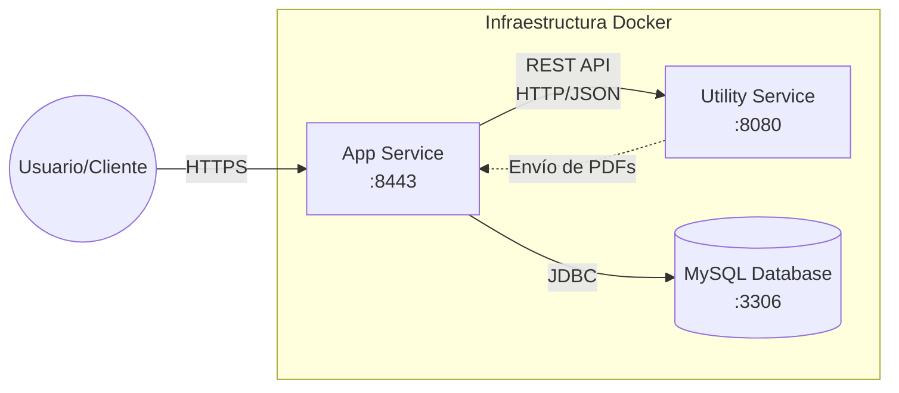


### **Instrucciones de Ejecución con Docker**

#### **Requisitos previos:**
- Docker instalado (versión 20.10 o superior)
- Docker Compose instalado (versión 2.0 o superior)

#### **Pasos para ejecutar con docker-compose:**

1. **Clonar el repositorio**:
   ```bash
   git clone https://github.com/CodeURJC-SSDD-2025-26/practica-ssdd-2025-26-grupo-7.git
   cd practica-ssdd-2025-26-grupo-7
   ```

2. **Iniciar la aplicación con Docker Compose**:
   ```bash
   cd docker
   docker-compose up -d
   ```
   
   > Esto levantará la infraestructura completa: MySQL, Utility Service y App Service.

### **Construcción de la Imagen Docker**

#### **Requisitos:**
- Docker instalado en el sistema

#### **Pasos para construir y publicar la imagen:**

1. **Navegar al directorio de Docker**:
   ```bash
   cd docker
   ```

2. **Construir y publicar las imágenes**:
   
   Puedes usar el script de PowerShell:
   ```powershell
   ./publish_images.ps1
   ```
   
   O manualmente:
   ```bash
   docker build -t anxelito/onetap-app-service -f app-service.Dockerfile ..
   docker build -t anxelito/onetap-utility-service -f utility-service.Dockerfile ..
   docker push anxelito/onetap-app-service
   docker push anxelito/onetap-utility-service
   ```

### **Despliegue en Máquina Virtual**

#### **Requisitos:**
- Acceso a la máquina virtual (SSH)
- Clave privada para autenticación
- Conexión a la red correspondiente o VPN configurada

#### **Pasos para desplegar:**

1. **Conectar a la máquina virtual**:
   ```bash
   ssh -i [ruta/a/clave.key] [usuario]@[IP-o-dominio-VM]
   ```
   
   Ejemplo:
   ```bash
   ssh -i ssh-keys/app.key vmuser@10.100.139.XXX
   ```

2. **AQUÍ LOS SIGUIENTES PASOS**:

### **URL de la Aplicación Desplegada**

🌐 **URL de acceso**: `https://[nombre-app].etsii.urjc.es:8443`

#### **Credenciales de Usuarios de Ejemplo**

| Rol | Usuario | Contraseña |
|:---|:---|:---|
| Administrador | admin | admin123 |
| Usuario Registrado | user1 | user123 |
| Usuario Registrado | user2 | user123 |

### **OTRA DOCUMENTACIÓN ADICIONAL REQUERIDA EN LA PRÁCTICA**

### **Participación de Miembros en la Práctica 3**

#### **Alumno 1 - [Angel Molinero Caja]**

[Me encargué de la dockerización completa de la arquitectura, creando Dockerfiles multi-stage para optimizar las imágenes de los microservicios y configurando la orquestación con Docker Compose para gestionar la base de datos y los servicios. Además, lideré el desarrollo inicial de la API REST, implementando los controladores principales para la gestión de torneos, usuarios y mensajes.]

| Nº    | Commits      | Files      |
|:------------: |:------------:| :------------:|
|1| [feat: add docker-compose configuration for mysql, utility, and app services](https://github.com/CodeURJC-SSDD-2025-26/practica-ssdd-2025-26-grupo-7/commit/d550667)  | [docker-compose.yml](https://github.com/CodeURJC-SSDD-2025-26/practica-ssdd-2025-26-grupo-7/blob/main/docker/docker-compose.yml)   |
|2| [REST: Add UserRestController, MessageRestController and GlobalApiExceptionHandler](https://github.com/CodeURJC-SSDD-2025-26/practica-ssdd-2025-26-grupo-7/commit/e110dd6)  | [UserRestController.java](https://github.com/CodeURJC-SSDD-2025-26/practica-ssdd-2025-26-grupo-7/blob/main/code/app-service/src/main/java/es/urjc/code/backend/rest/UserRestController.java)   |
|3| [REST: Add TournamentRestController with CRUD, pagination, PDF and image endpoints](https://github.com/CodeURJC-SSDD-2025-26/practica-ssdd-2025-26-grupo-7/commit/61a197d)  | [TournamentRestController.java](https://github.com/CodeURJC-SSDD-2025-26/practica-ssdd-2025-26-grupo-7/blob/main/code/app-service/src/main/java/es/urjc/code/backend/rest/TournamentRestController.java)   |
|4| [Docker: Add PowerShell scripts to build and publish images to DockerHub](https://github.com/CodeURJC-SSDD-2025-26/practica-ssdd-2025-26-grupo-7/commit/c000c94)  | [publish_images.ps1](https://github.com/CodeURJC-SSDD-2025-26/practica-ssdd-2025-26-grupo-7/blob/main/docker/publish_images.ps1)   |
|5| [Docker: Add multi-stage Dockerfiles for app-service and utility-service](https://github.com/CodeURJC-SSDD-2025-26/practica-ssdd-2025-26-grupo-7/commit/9bc07a7)  | [app-service.Dockerfile](https://github.com/CodeURJC-SSDD-2025-26/practica-ssdd-2025-26-grupo-7/blob/main/docker/app-service.Dockerfile)   |

---
 
#### **Alumno 2 - [Pedro González Martín]**

[Me he encargado de dos partes principalmente: la separación de la arquitectura en microservicios y la seguridad JWT de la API REST. Extraje la funcionalidad de generación de PDFs desde el servicio principal hacia un nuevo microservicio independiente (`utility-service`), exponiendo un endpoint REST para su consumo mediante `RestTemplate` desde el `app-service`. Además, configuré toda la capa de seguridad basada en tokens JWT para la nueva API REST, implementando el controlador de autenticación (`AuthRestController`) y adaptando los filtros de Spring Security.]

| Nº    | Commits      | Files      |
|:------------: |:------------:| :------------:|
|1| [feat: implement JwtAuthenticationFilter and webFilterChain to SecurityConfiguration.java](https://github.com/CodeURJC-SSDD-2025-26/practica-ssdd-2025-26-grupo-7/commit/8e7ef72bd85558e4c866b5dde3fd791600e3a076)  | [SecurityConfiguration.java](https://github.com/CodeURJC-SSDD-2025-26/practica-ssdd-2025-26-grupo-7/blob/8e7ef72bd85558e4c866b5dde3fd791600e3a076/code/app-service/src/main/java/es/urjc/code/backend/security/SecurityConfiguration.java)   |
|2| [feat: implement REST Auth controller and adapt UserService for JWT registration](https://github.com/CodeURJC-SSDD-2025-26/practica-ssdd-2025-26-grupo-7/commit/e8660a8cd2a71d977fc092d18c67e8af349bf7cf)  | [AuthRestController.java](https://github.com/CodeURJC-SSDD-2025-26/practica-ssdd-2025-26-grupo-7/blob/e8660a8cd2a71d977fc092d18c67e8af349bf7cf/code/app-service/src/main/java/es/urjc/code/backend/rest/AuthRestController.java)   |
|3| [feat: utility-service base](https://github.com/CodeURJC-SSDD-2025-26/practica-ssdd-2025-26-grupo-7/commit/3e2c806d6ce2a9feedbb59e84cf08695a6df0d69)  | [pom.xml (utility-service)](https://github.com/CodeURJC-SSDD-2025-26/practica-ssdd-2025-26-grupo-7/blob/3e2c806d6ce2a9feedbb59e84cf08695a6df0d69/code/utility-service/pom.xml)   |
|4| [update: pdfService in utility-service, separated service REST](https://github.com/CodeURJC-SSDD-2025-26/practica-ssdd-2025-26-grupo-7/commit/09e75bced629c7898c68d650bf33470ff6203448)  | [PdfRestController.java](https://github.com/CodeURJC-SSDD-2025-26/practica-ssdd-2025-26-grupo-7/blob/09e75bced629c7898c68d650bf33470ff6203448/code/utility-service/src/main/java/es/urjc/code/utilityservice/controller/PdfRestController.java)   |
|5| [feat: app-service calls utility-service for pdf generation](https://github.com/CodeURJC-SSDD-2025-26/practica-ssdd-2025-26-grupo-7/commit/39d8993a651c3f0141248c8d3837cbf4fe30feb2)  | [TournamentRestController.java](https://github.com/CodeURJC-SSDD-2025-26/practica-ssdd-2025-26-grupo-7/blob/39d8993a651c3f0141248c8d3837cbf4fe30feb2/code/app-service/src/main/java/es/urjc/code/backend/rest/TournamentRestController.java)   |

---

#### **Alumno 3 - [Nombre Completo]**

[Descripción de las tareas y responsabilidades principales del alumno en el proyecto]

| Nº    | Commits      | Files      |
|:------------: |:------------:| :------------:|
|1| [Descripción commit 1](URL_commit_1)  | [Archivo1](URL_archivo_1)   |
|2| [Descripción commit 2](URL_commit_2)  | [Archivo2](URL_archivo_2)   |
|3| [Descripción commit 3](URL_commit_3)  | [Archivo3](URL_archivo_3)   |
|4| [Descripción commit 4](URL_commit_4)  | [Archivo4](URL_archivo_4)   |
|5| [Descripción commit 5](URL_commit_5)  | [Archivo5](URL_archivo_5)   |

---